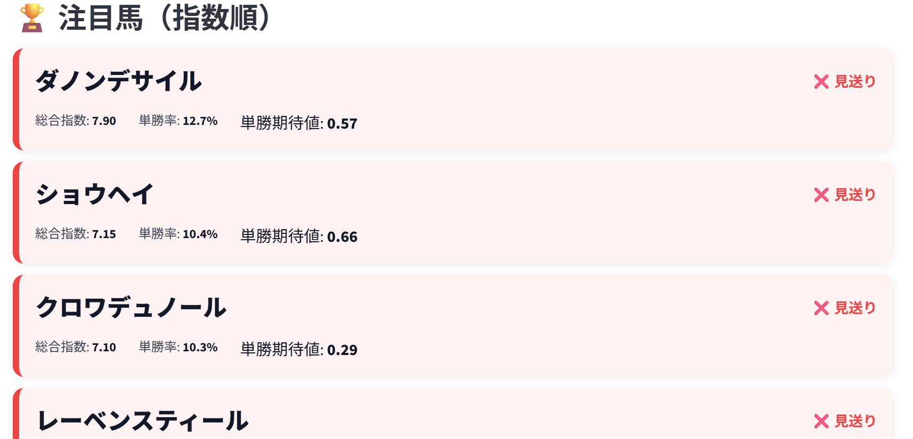
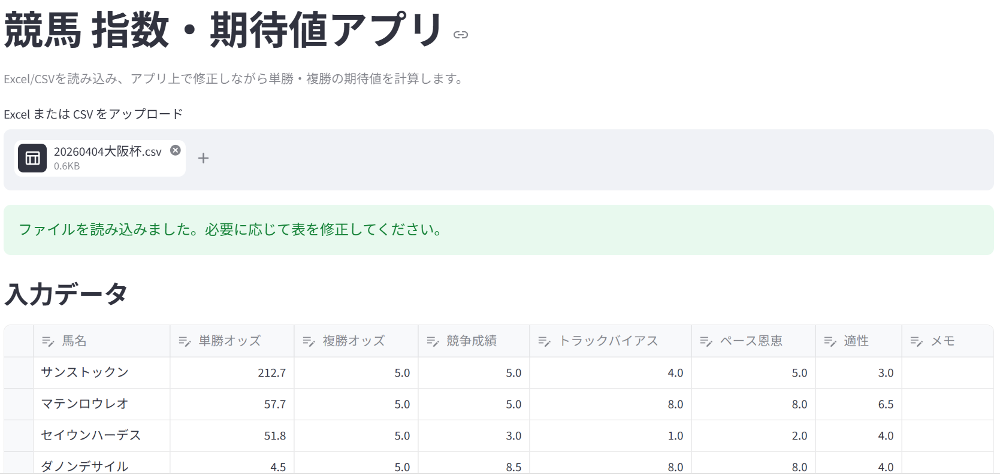

# 競馬 指数・期待値アプリ
競馬予想における「指数 → 勝率 → 期待値」を数値化し、意思決定を支援するアプリ




## ① 概要
競馬予想における「指数 → 勝率 → 期待値」の流れを数値化し、
主観的な予想を定量的に判断できるようにするアプリです。

## ② 背景
これまで競馬予想では、
「なんとなく強そう」「この馬は来そう」といった体感に頼る部分が多くありました。

そこで、
・強さ（指数）
・勝率
・期待値

の関係を明確に数値化することで、
予想の根拠を言語化・再現可能にしたいと考え、本アプリを開発しました。

また、自身の興味である競馬を題材に、
統計的な考え方やデータ活用の理解を深めることも目的としています。

## ③ 機能
- 各要素（競争成績・バイアス・ペース・適性）から指数を算出
- 指数をもとに勝率を計算（k乗による分布調整）
- 単勝・複勝の期待値を算出
- 期待値に基づく「買い / 見送り」判定
- Streamlit上でのデータ編集・即時計算
- CSV/Excelの入力・出力対応

## ④ 工夫した点
- 指数をそのまま確率に変換するのではなく、k乗することで上位馬に確率が寄るよう調整
- 競馬特有の「複勝率」を簡易モデルで補正
- 重みをUIから調整可能にし、自分の予想スタイルを反映できる設計
- 「指数順」での表示により、実際の予想プロセスに近い形で可視化

## ⑤ 使用技術
- Python
- Streamlit
- pandas
- NumPy

## ⑥ 使い方

```bash
streamlit run appmain.py
```

## ⑦ 今後の改善

### モデル改善
- 実際のレース結果データを用いたパラメータ最適化
- 指数 → 勝率の変換を機械学習でモデル化

### UI改善
- 視覚的な比較（グラフ表示など）

### 戦略改善
- 購入戦略（資金配分）の最適化
 
 ## 開発メモ
- [意思決定ログ](docs/decisions.md)
- [学んだことログ](docs/learnings.md) 

## アプリ画面 
### 入力画面


CSVを読み込み、オッズや各評価項目をアプリ上で確認・編集できます。

### 出力画面


指数・勝率・期待値を計算し、注目馬を指数順で表示します。